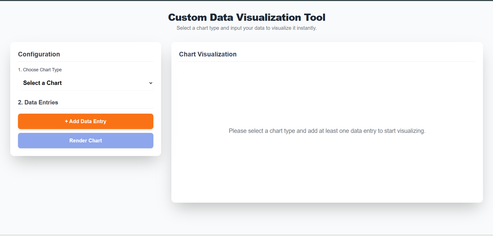
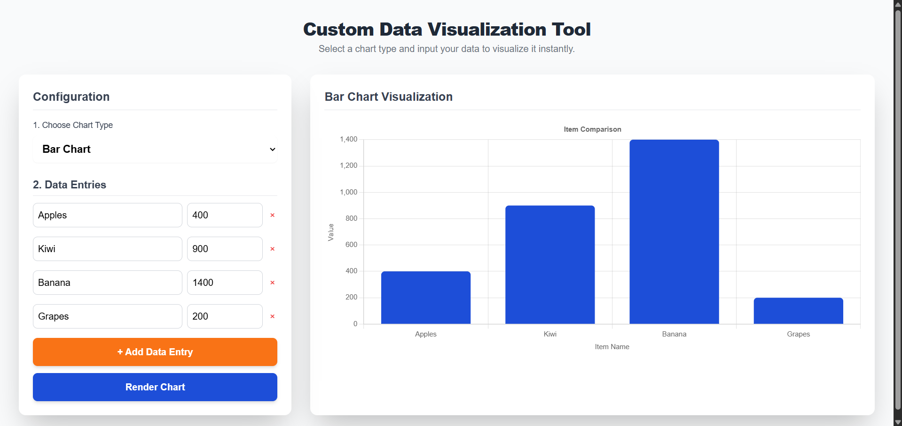

# 🧩 Custom Data Visualization Tool

## 📊 Overview
The **Custom Data Visualization Tool** is an interactive web application that allows users to create and visualize datasets in real time.  
Users can select a chart type (Bar, Line, or Pie), input custom data entries, and instantly render the corresponding visualization using **Chart.js**.  
The interface is built with **Tailwind CSS** for a clean, responsive, and modern design.

---

## 🚀 Features
- 🧮 **Dynamic Data Input:** Add, edit, or remove data entries easily.  
- 🎨 **Multiple Chart Types:** Choose between **Bar**, **Line**, and **Pie** charts.  
- ⚙️ **Real-Time Rendering:** See instant visual updates with a single click.  
- 🧠 **Smart Validation:** Input fields ensure valid names and numeric values before rendering.  
- 📱 **Responsive UI:** Fully responsive layout powered by **Tailwind CSS**.  
- 💡 **Customizable Colors:** Uses a predefined color palette for vibrant visualizations.

---

## 📸 Preview

### 🏠 Home Interface

### 📊 Example Chart

---
## 🌐 Live Demo
🔗 [View Live Demo](https://anchal-c09.github.io/Custom-Data-Visualization-Tool/)

---

## 🛠️ Technologies Used
- **HTML5** – Structure and markup  
- **CSS3 / Tailwind CSS** – Styling and responsive design  
- **JavaScript (Vanilla JS)** – Logic, interactivity, and DOM manipulation  
- **Chart.js** – Chart rendering and data visualization  

---

## 🧭 How to Use

- Select a chart type (Bar, Line, or Pie) from the dropdown.
- Enter your data entries — each with a name (label) and numeric value.
- Click Render Chart to visualize the data instantly.
- Add or remove data entries as needed — the chart updates dynamically.

---
## 🧑‍💻 Author
Anchal Chaubey

💼 [LinkedIn](https://github.com/Anchal-C09).| 💻 [GitHub](https://github.com/Anchal-C09)

## 🪪 License
This project is open-source and available under the MIT License.
